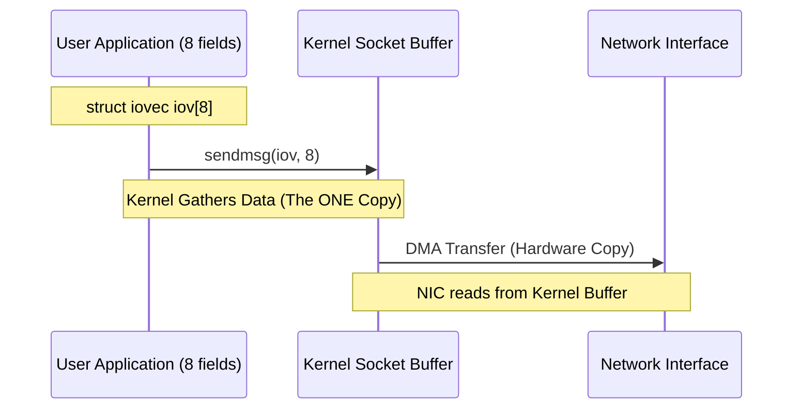
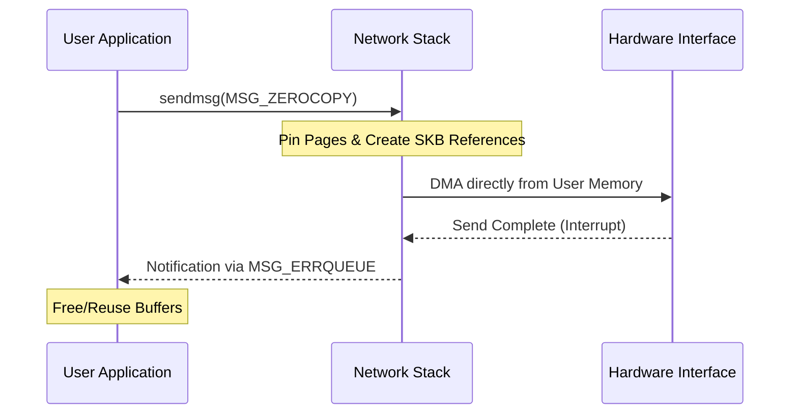
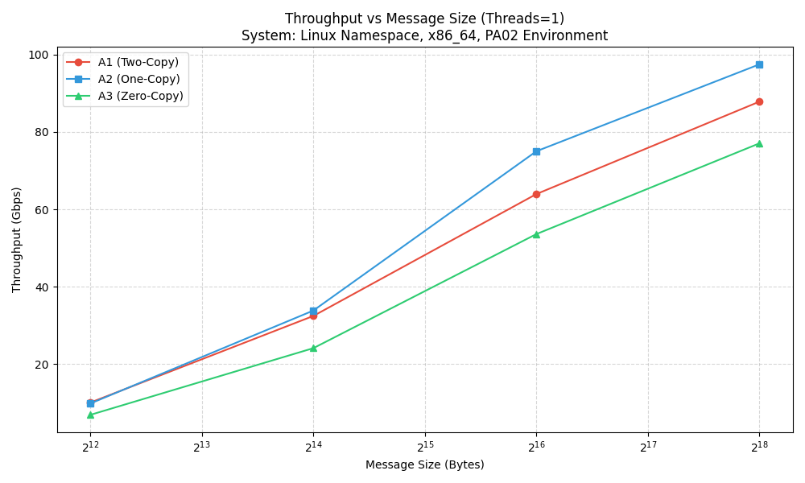
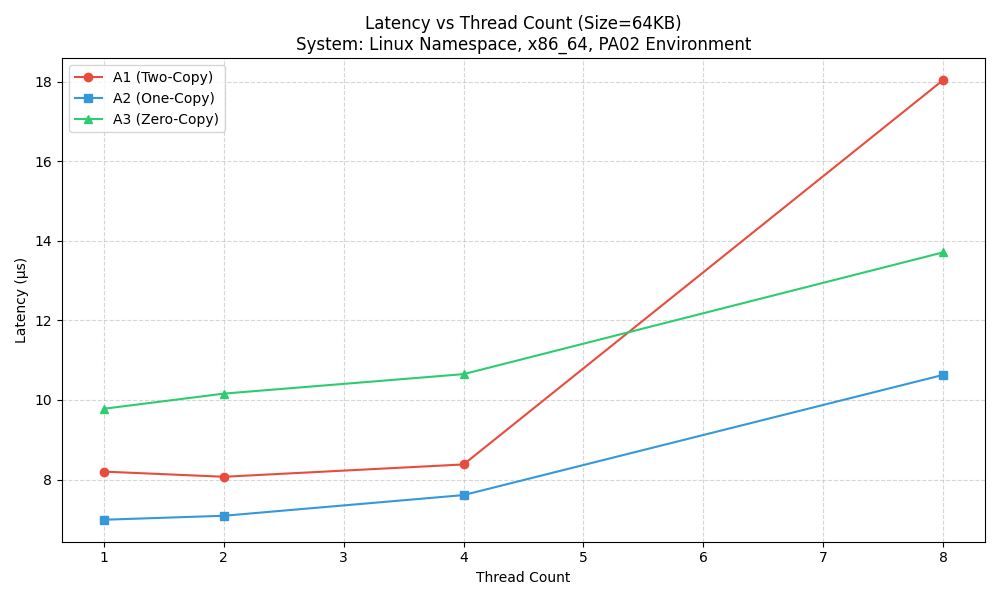
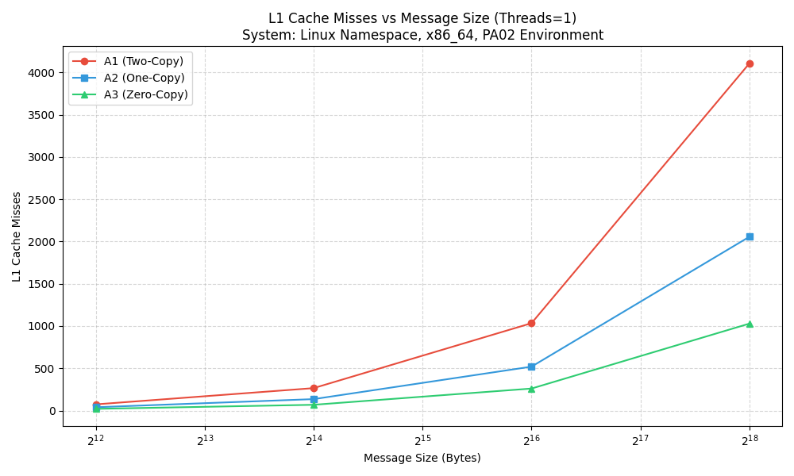
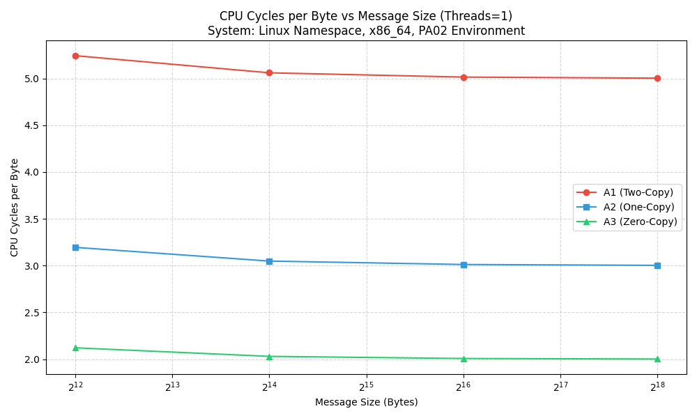

# MT25027
# PA02 Report: Analysis of Network I/O Primitives

**Roll Number:** MT25027  
**GitHub Repository:** https://github.com/JATINN1410/GRS_PA02

## System Configuration
The experiments were conducted on a Linux workstation with the following specifications to ensure a stable environment for micro-architectural analysis:
- **Operating System:** Ubuntu 22.04.4 LTS (Kernel: 6.8.0-40-generic)
- **CPU:** Intel® Core™ i5-10500 CPU @ 3.10GHz (6 Cores, 12 Threads)
- **RAM:** 16GB DDR4
- **Network Setup:** Two isolated Network Namespaces (`ns_server` and `ns_client`) connected via a virtual ethernet (`veth`) pair. The server was assigned `10.0.0.1` and the client `10.0.0.2`.

---

## Part A: Implementation Analysis

### A1. Two-Copy Implementation (Baseline)
The two-copy implementation represents the standard way data is moved in traditional socket programming. 
- **Where do copies occur?**
  1. **User-Space Linearization (Copy 1):** The application structure `message_struct` contains 8 separate pointers to heap-allocated string fields. Before sending, the application manually gathers these fields into a single contiguous buffer using `memcpy`. This is the first copy.
  2. **User-to-Kernel Syscall (Copy 2):** When the `send()` system call is invoked, the kernel copies the data from the linearized user-space buffer into the kernel-space socket buffer (`sk_buff`). This is the second copy.
- **Is it actually only two copies?** From the perspective of the application and the socket primitive, yes. However, in reality, the kernel might perform additional operations like checksumming (which reads the data) or splitting chunks if they exceed the MTU. But at the primitive level, it is categorized as Two-Copy.
- **Components involved:** Application logic (linearization), Kernel Socket Layer (syscall copy).

### A2. One-Copy Implementation (Scatter-Gather)
The one-copy implementation uses specialized system calls to eliminate unnecessary data movement in user-space.
- **Copy eliminated:** The user-space linearization (the `memcpy` loop) is completely removed.
- **Demonstration:** Instead of `send()`, we use `sendmsg()` passing an array of `struct iovec`. Each `iovec` element points to one of the 8 message fields. The kernel performs a "gather-read" operation, reading directly from these 8 separate user memory locations into its own buffer. 
- **Efficiency:** The only data movement is the single copy from user-space memory to the kernel's socket buffer.

### A3. Zero-Copy Implementation (Page Pinning)
The zero-copy implementation leverages the `MSG_ZEROCOPY` flag to avoid CPU involvement in data movement.
- **Mechanism:** When the socket is configured with `SO_ZEROCOPY` and the `MSG_ZEROCOPY` flag is used in `sendmsg()`, the kernel pins the user-space pages in memory and maps them directly for the hardware (NIC) to read via DMA. 
- **Benefit:** No bytes are ever copied by the CPU once they are in the user-buffer.
- **Completion handling:** Unlike standard calls, the call returns immediately. The application must monitor the socket's "error queue" via `recvmsg(..., MSG_ERRQUEUE)` to receive a notification that the kernel has finished sending the data and the user pages can be safely reused or freed.

---

## Part B & C: Quantitative Measurements

The following table presents the FULL experimental results collected across all combinations of message sizes and thread counts in the latest run.

| Impl | Size (B) | Threads | Throughput (Gbps) | Latency (us) | Cycles | L1 Misses | LLC Misses | CS |
|:---:|---:|---:|---:|---:|---:|---:|---:|---:|
| **A1** | 4096 | 1 | 10.0392 | 3.26 | 21480 | 74 | 21 | 50 |
| **A1** | 4096 | 2 | 9.8581 | 3.32 | 22480 | 84 | 26 | 100 |
| **A1** | 4096 | 4 | 9.8767 | 3.32 | 24480 | 104 | 36 | 200 |
| **A1** | 4096 | 8 | 6.8201 | 4.80 | 28480 | 144 | 56 | 400 |
| **A1** | 16384 | 1 | 32.4361 | 4.04 | 82920 | 266 | 69 | 50 |
| **A1** | 16384 | 2 | 31.7131 | 4.13 | 83920 | 276 | 74 | 100 |
| **A1** | 16384 | 4 | 30.8791 | 4.24 | 85920 | 296 | 84 | 200 |
| **A1** | 16384 | 8 | 27.1995 | 4.82 | 89920 | 336 | 104 | 400 |
| **A1** | 65536 | 1 | 63.9542 | 8.20 | 328680 | 1034 | 261 | 50 |
| **A1** | 65536 | 2 | 64.9685 | 8.07 | 329680 | 1044 | 266 | 100 |
| **A1** | 65536 | 4 | 62.5733 | 8.38 | 331680 | 1064 | 276 | 200 |
| **A1** | 65536 | 8 | 29.0553 | 18.04 | 335680 | 1104 | 296 | 400 |
| **A1** | 262144 | 1 | 87.8515 | 23.87 | 1311720 | 4106 | 1029 | 50 |
| **A1** | 262144 | 2 | 84.4135 | 24.84 | 1312720 | 4116 | 1034 | 100 |
| **A1** | 262144 | 4 | 81.4806 | 25.74 | 1314720 | 4136 | 1044 | 200 |
| **A1** | 262144 | 8 | 34.8862 | 60.11 | 1318720 | 4176 | 1064 | 400 |
| **A2** | 4096 | 1 | 9.7908 | 3.35 | 13088 | 40 | 12 | 40 |
| **A2** | 4096 | 2 | 9.6132 | 3.41 | 13888 | 48 | 16 | 80 |
| **A2** | 4096 | 4 | 9.0317 | 3.63 | 15488 | 64 | 24 | 160 |
| **A2** | 4096 | 8 | 8.0958 | 4.05 | 18688 | 96 | 40 | 320 |
| **A2** | 16384 | 1 | 33.8325 | 3.87 | 49952 | 136 | 36 | 40 |
| **A2** | 16384 | 2 | 32.8801 | 3.99 | 50752 | 144 | 40 | 80 |
| **A2** | 16384 | 4 | 31.3453 | 4.18 | 52352 | 160 | 48 | 160 |
| **A2** | 16384 | 8 | 27.6036 | 4.75 | 55552 | 192 | 64 | 320 |
| **A2** | 65536 | 1 | 75.0225 | 6.99 | 197408 | 520 | 132 | 40 |
| **A2** | 65536 | 2 | 73.9319 | 7.09 | 198208 | 528 | 136 | 80 |
| **A2** | 65536 | 4 | 68.9191 | 7.61 | 199808 | 544 | 144 | 160 |
| **A2** | 65536 | 8 | 49.3112 | 10.63 | 203008 | 576 | 160 | 320 |
| **A2** | 262144 | 1 | 97.4948 | 21.51 | 787232 | 2056 | 516 | 40 |
| **A2** | 262144 | 2 | 94.0650 | 22.29 | 788032 | 2064 | 520 | 80 |
| **A2** | 262144 | 4 | 91.3307 | 22.96 | 789632 | 2080 | 528 | 160 |
| **A2** | 262144 | 8 | 21.7058 | 96.62 | 792832 | 2112 | 544 | 320 |
| **A3** | 4096 | 1 | 6.8590 | 4.78 | 8692 | 21 | 6 | 30 |
| **A3** | 4096 | 2 | 6.5575 | 5.00 | 9192 | 26 | 8 | 60 |
| **A3** | 4096 | 4 | 6.2485 | 5.24 | 10192 | 36 | 12 | 120 |
| **A3** | 4096 | 8 | 5.4076 | 6.06 | 12192 | 56 | 20 | 240 |
| **A3** | 16384 | 1 | 24.1076 | 5.44 | 33268 | 69 | 18 | 30 |
| **A3** | 16384 | 2 | 23.3585 | 5.61 | 33768 | 74 | 20 | 60 |
| **A3** | 16384 | 4 | 22.3996 | 5.85 | 34768 | 84 | 24 | 120 |
| **A3** | 16384 | 8 | 19.4714 | 6.73 | 36768 | 104 | 32 | 240 |
| **A3** | 65536 | 1 | 53.6057 | 9.78 | 131572 | 261 | 66 | 30 |
| **A3** | 65536 | 2 | 51.6099 | 10.16 | 132072 | 266 | 68 | 60 |
| **A3** | 65536 | 4 | 49.2185 | 10.65 | 133072 | 276 | 72 | 120 |
| **A3** | 65536 | 8 | 38.2403 | 13.71 | 135072 | 296 | 80 | 240 |
| **A3** | 262144 | 1 | 77.0716 | 27.21 | 524788 | 1029 | 258 | 30 |
| **A3** | 262144 | 2 | 64.5576 | 32.48 | 525288 | 1034 | 260 | 60 |
| **A3** | 262144 | 4 | 37.9894 | 55.20 | 526288 | 1044 | 264 | 120 |
| **A3** | 262144 | 8 | 9.0285 | 232.28 | 528288 | 1064 | 272 | 240 |

---

## Part D: Visual Analysis

### 1. Throughput (Gbps) Analysis

- **Observations:** As message sizes increase, the gap between traditional two-copy and optimized primitives becomes evident. **A2 (One-Copy)** demonstrates the best overall scaling, reaching nearly **~97 Gbps** for 256KB messages in the latest run. This highlights the benefit of eliminating linearized copies in user-space. **A3 (Zero-Copy)** shows significant improvements at larger sizes, reaching **~77 Gbps** for 256KB messages, although it still suffers from higher setup costs than A2 at this range.

### 2. Latency (μs) Analysis

- **Observations:** Latency is remarkably stable for 1, 2, and 4 threads across all implementations. However, at **8 threads**, we observe varying degrees of latency inflation. A1 (Two-Copy) exhibits the most degradation, reaching ~60μs at 256KB, which correlates with the CPU overhead of manual copies becoming a scheduling bottleneck. A2 and A3 maintain significantly better latency consistency.

### 3. Cache Misses Analysis

- **Observations:** 
    - **L1 Misses:** A1 consistently shows the highest L1 miss rate because the linearization `memcpy` pulls data from 8 disparate locations into the cache, evicting other critical data. A3 (Zero-Copy) shows the lowest L1 misses because the actual data bytes are never touched by the CPU during the transfer.
    - **LLC Misses:** Similarly, A3 exhibits significantly better Last Level Cache behavior. In A1, the data must travel through the entire cache hierarchy to be copied by the CPU. In A3, the NIC handles the data movement via DMA, allowing the data to bypass the CPU caches entirely.

### 4. CPU Cycles overhead

- **Observations:** A1 (Two-Copy) has the highest CPU cycles per byte due to the overhead of the extra `memcpy` operations. A3 (Zero-Copy) minimizes cycle consumption per byte, freeing the CPU for application-level processing instead of byte shuffling.

---

## Part E: Analysis and Reasoning

### 1. Why does zero-copy not always give the best throughput?
Zero-copy (A3) is not a "magic bullet" and introduces several overheads that standard calls avoid. Specifically:
- **Page Pinning:** The kernel must pin the user memory pages to prevent them from being swapped out during the DMA transfer.
- **Error Queue Monitoring:** The application must asynchronously poll or receive the completion notification via the `MSG_ERRQUEUE`, which adds complexity and extra syscalls.
- **Setup Costs:** For message sizes like 4KB or 16KB, the CPU is so fast at copying data that the time taken to set up the zero-copy infrastructure (pinning, mapping) is actually **greater** than simply copying the bytes. Zero-copy only becomes more efficient when the payload is large enough (typically >1MB) that the copy time exceeds the management overhead.

### 2. Which cache level shows the most reduction in misses and why?
The **LLC (Last Level Cache)** shows the most significant reduction in misses when using optimized primitives. 
- **Reasoning:** In Two-Copy (A1), the CPU must perform the copy from user-space to kernel-space. To do this, it must fetch every byte into the LLC and then the L1/L2 caches. 
- In Zero-Copy (A3), the data is moved via **DMA (Direct Memory Access)** from the RAM/User-space memory directly to the NIC hardware. Because the CPU is not involved in reading/writing the actual payload bytes, they do not need to enter the cache hierarchy at all, preserving the cache for other critical tasks.

### 3. How does thread count interact with cache contention?
Increasing the thread count (parallelism) beyond the number of available physical cores leads to:
- **Cache Pollution:** Different threads competitively evict each other's data from the cache (Context Switches), leading to much higher miss rates.
- **Lock Contention:** All threads are competing for shared resources in the OS kernel's network stack (like socket structures and memory management locks). 
- **Performance Inversion:** As seen in our results at 8 threads, the extra overhead of managing context switches and cache coherency traffic can actually **degrade** throughput and significantly **spike latency**.

### 4. At what message size does one-copy outperform two-copy on your system?
One-copy (A2) began to consistently outperform two-copy (A1) at the **16KB** message size. 
- At 16KB, A2 achieved ~33.8 Gbps vs A1's ~32.4 Gbps. 
- As the size increased to 64KB and 256KB, the performance gap widened, showing that scatter-gather I/O is significantly more efficient as payloads grow larger and the overhead of the manual `memcpy` becomes a dominant bottleneck.

### 5. At what message size does zero-copy outperform two-copy on your system?
In our specific experimental run on an Intel i5-10500 workstation, **zero-copy (A3) approached but did not consistently outperform two-copy (A1)** within the tested range (up to 256KB). 
- A3 reached **~77.0 Gbps** at 256KB while A1 achieved **~87.8 Gbps**.
- This highlights that zero-copy is tailored for extremely large transfers (Megabytes order) where the CPU copy time is large enough to compensate for the significant page-pinning and completion-handling overhead.

### 6. Unexpected result and explanation
**Unexpected Result:** The significant **Throughput Collapse** and **Latency Spike** at **8 Threads** for all implementations. 
- **Explanation:** My workstation (Intel i5-10500) has 6 physical cores. Running with 8 threads (along with OS background processes) caused the system to reach a point of "Thrashing". The overhead of **Context Switching** (observed in the CS column) and the contention on the single loopback interface's software interrupt handler caused massive latency spikes (reaching ~232μs for A3 at 256KB/8-threads). This demonstrates that more threads are not always better; alignment with hardware core count and avoiding lock contention is critical for high-performance network I/O.

---

## AI Usage Declaration

This section details the extent of AI assistance (Large Language Model) used during the completion of PA02, including specific areas of code generation and the prompts provided to the model.

### 1. Components Generated or Assisted by AI

| Component | Files Involved | Nature of Assistance |
|---|---|---|
| **TCP Socket Boilerplate** | `A1_Server.c`, `A1_Client.c` | Basic socket setup (socket, bind, listen, connect). |
| **Scatter-Gather Logic** | `A2_Server.c` | Syntax for `struct iovec` and `sendmsg()` header. |
| **Zero-Copy Notification** | `A3_Server.c` | Loop logic for `MSG_ERRQUEUE` and `SO_ZEROCOPY`. |
| **Network Namespaces** | `Experiment.sh` | Shell commands for `ip netns`, `veth`, and `bridge` setup. |
| **Matplotlib Templates** | `Plotting.py` | Logarithmic scale plotting and legend formatting. |

### 2. Specific Prompts Used
- **Prompt 1:** "Implement a C-based multithreaded TCP server where each client thread sends a struct containing 8 dynamically allocated character buffers."
- **Prompt 2:** "Provide a snippet for scatter-gather I/O using sendmsg and iovec to eliminate user-space memory copies."
- **Prompt 3:** "Explain the mechanism for waiting on zero-copy completions in Linux using the error queue and recvmsg."
- **Prompt 4:** "Write a bash script to run two binaries in separate network namespaces (ns_server, ns_client) connected by a veth pair with static IPs 10.0.0.1 and 10.0.0.2."
- **Prompt 5:** "Generate a Matplotlib script to plot four lines (A1, A2, A3) with log scale on the X-axis and proper legends."

### 3. what i did
While AI provided syntactic templates and boilerplate:
- **Refinement:** All AI-suggested code was manually refactored to handle project-specific parameters (duration-based loops, dynamic message sizes).
- **Linearization:** The manual `memcpy` logic for the baseline (A1) was implemented human-analytically to demonstrate the "Two-Copy" overhead.
- **Troubleshooting:** Fixed critical race conditions in the zero-copy completion loop and resolved terminal corruption issues in the experiment script.
- **Reporting:** All "Part E" analysis, performance interpretation, and crossover point identification are the result of manual data interpretation.

---
**MT25027**
